<p align="center">
  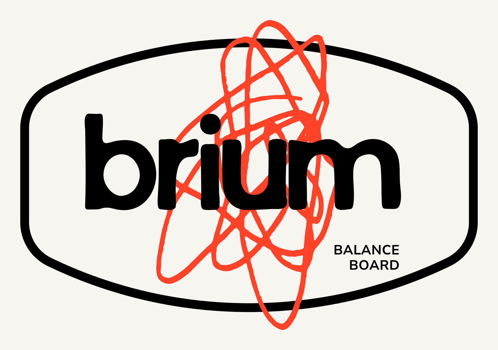
</p>

# Brium Board

*Brium* — the tail of *equilibrium*.

A rocker-style balance board and stand, cut from a **single 2 ft × 2 ft plywood
sheet** (610 × 610 mm), balanced on a lacrosse ball.

The board profile, the stand and the ball guard all come from **[dtxtr's
"Balance Board Stand (board and ball)"](https://www.printables.com/model/1341613-balance-board-stand-board-and-ball)**
on Printables. What this repo adds is the piece that model doesn't include: a
**3D-printed stencil** that lays the cut line out on your plywood — correctly
scaled to a 2×2 sheet, symmetric by construction, and drawn from one printed
template that works at all four corners.

<!-- IMAGE still needed: hero shot — finished board on the stand, ball underneath,
     good light. When shot, save as docs/images/finished-board.jpg and restore:
 -->

---

## What you make

| Part | Material | Source |
| --- | --- | --- |
| Brium board | 12 mm plywood, 360 × 610 mm | cut it yourself — **this repo's stencil** |
| Stand | 3D printed | `stl/brium_stand.stl` — remixed from [dtxtr's design](https://www.printables.com/model/1341613-balance-board-stand-board-and-ball) |
| Ball guard | 12 mm plywood | [dtxtr on Printables](https://www.printables.com/model/1341613-balance-board-stand-board-and-ball) — cut from the offcut |
| Ball | lacrosse ball | any sporting goods shop |

Everything printed here is a **jig**, not a part of the finished board. Once the
plywood is cut, the stencil's job is done.

---

## Bill of materials

| Item | Spec | Notes |
| --- | --- | --- |
| Plywood | 610 × 610 × 12 mm | 2 ft × 2 ft hobby panel. Birch ply is what the original used; void-free matters more than species |
| Lacrosse ball | [standard](https://www.amazon.ca/dp/B072373GWG), ~63 mm | solid rubber. Do not substitute a tennis ball |
| Filament | ~40 g for the stencil, ~150 g per stand piece | PLA is fine for both |
| 3 mm rod | 40 mm | joins the two stencil halves. A stub of 1.75 mm filament doubled over, an M3 bolt, or a brad nail all work |
| Sandpaper | 80 / 120 / 220 grit | |
| Finish | oil, poly or hardwax | your call |

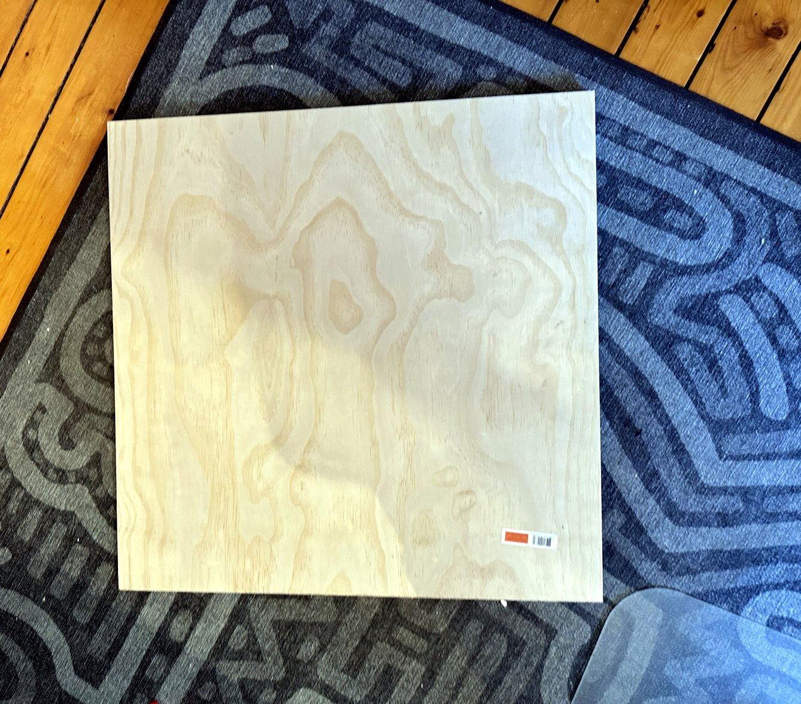

---

## The cut

Your sheet is 610 × 610. Rip it once:

```
┌─────────────────────────── 610 ───────────────────────────┐
│                                                           │
│   BOARD          360 mm wide × 610 mm long                │  610
│                                                           │
├───────────────────────────────────────────────────────────┤
│   OFFCUT         250 mm × 610 mm  →  ball guard           │
└───────────────────────────────────────────────────────────┘
```

The board keeps the **full 610 mm length** of the sheet and gets ripped to
**360 mm wide**. The 250 mm offcut is more than enough for the ball guard.

The rounded outline is then laid out **inside** that 360 × 610 rectangle — it
touches all four edges, so you lose nothing to the curve.

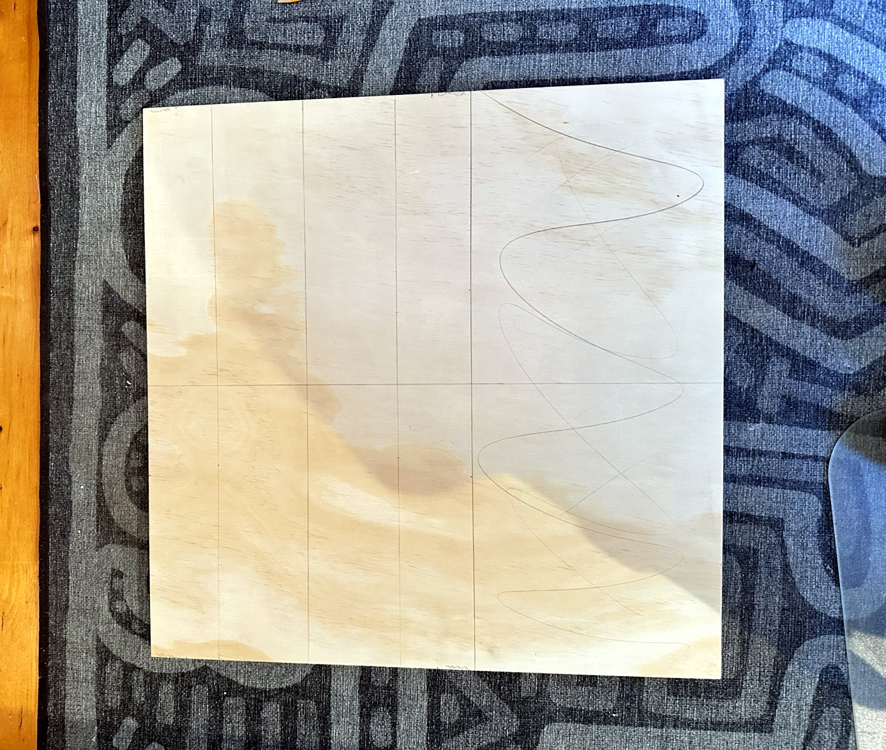

---

## The geometry

dtxtr's profile is a 540 × 310 outline built from four elements per side: a
straight flat on each short end, a tight corner radius, and one long sweep arc
down each side. Scaled to a 2×2 sheet:

| Element | dtxtr's original (540 × 310) | This build (610 × 360) |
| --- | --- | --- |
| Overall length | 540 mm | **610 mm** (full sheet) |
| Overall width | 310 mm | **360 mm** |
| Straight flat, each short end | 110 mm | **128 mm** |
| Corner radius | R50 | **R60** |
| Long sweep radius | R559 | **R623.94** |
| Sweep centre, below the long centreline | 404 mm | **443.94 mm** |
| Arcs meet tangent at | — | **(271.1, 118.0)** |

The sweep radius is **not a free choice.** It is solved so the long arc is
tangent to the corner arc *and* peaks exactly on the board edge at mid-length:

```
R = ( (L − rc)² + (W − a)² − rc² ) / ( 2 · (W − a − rc) )

L  = 305   half length        a  = 64   half the end flat
W  = 180   half width         rc =  60   corner radius
```

That is what keeps the outline fair — no visible kink where the corner meets
the sweep. Change the end flat or the corner radius in the .scad and the sweep
re-solves itself.

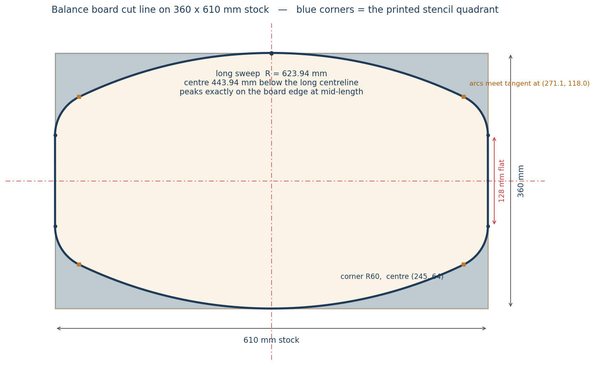

---

## The stencil

The printed part is the **waste crescent** between the board corner and the cut
line — the material you're about to remove. It's a rib frame: a 9 mm rib
hugging the cut line (the edge you trace against), a 6 mm flange along each
board edge, and three cross ribs.

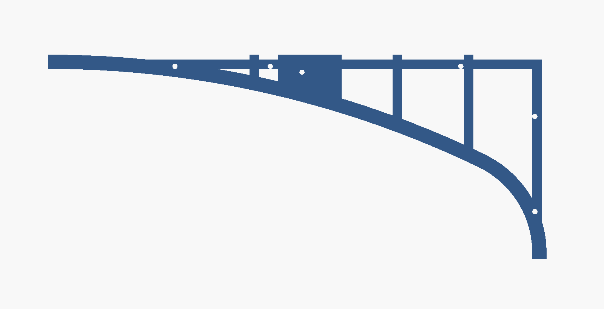

### One template, four corners

The outline is symmetric about both centrelines, so the *shape* at every corner
is identical. A quadrant isn't mirror-symmetric though — two corners want it
left-handed, two want it right-handed. A flat part handles that by flipping
over, so the stencil registers **both ways up**:

| Corner | Orientation | How it locates |
| --- | --- | --- |
| top-right | lip down | flanges hook the plywood corner |
| bottom-left | lip down, rotated 180° | same |
| top-left | flipped, lip up | pegs dropped into the flange holes |
| bottom-right | flipped, rotated 180° | same |

**Lip down** — the flanges hang 6 mm past the board edges and drop 3 mm. Seat
it on a corner and it hooks both edges. It can only sit in one place.

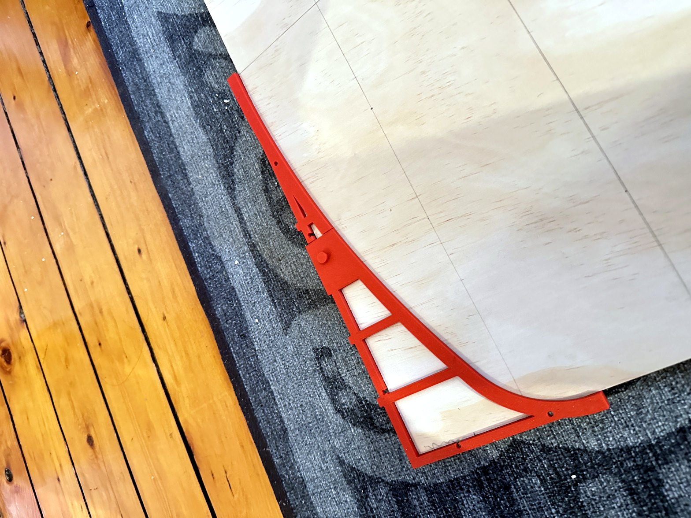

**Flipped** — the lip now faces up and hooks nothing, so five loose pegs take
over. Their holes are placed so the **inner tangent of the peg sits exactly on
the board edge line**, and a through-hole is symmetric about the plate's
mid-plane, so the registration survives the flip.

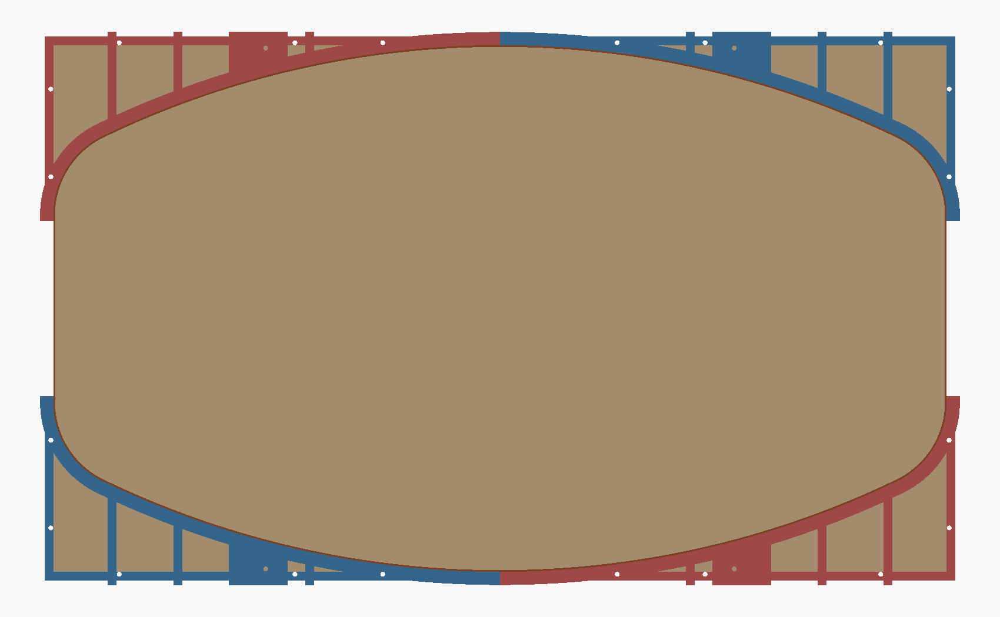

### Using it

1. Mark both centrelines on the plywood — mid-length and mid-width.
2. Lip down, hook the stencil over a corner, both flanges hard against the
   edges. **Check:** the straight edge at the mid-length end should land on your
   centreline. If it does, the geometry is right.
3. Trace the inner curved edge.
4. Rotate 180° for the opposite corner.
5. Flip the stencil, press the pegs in, seat them against the board edges, and
   do the remaining two corners.
6. The short ends need no tracing — the cut line runs along the existing edge
   for 128 mm before it curves away.

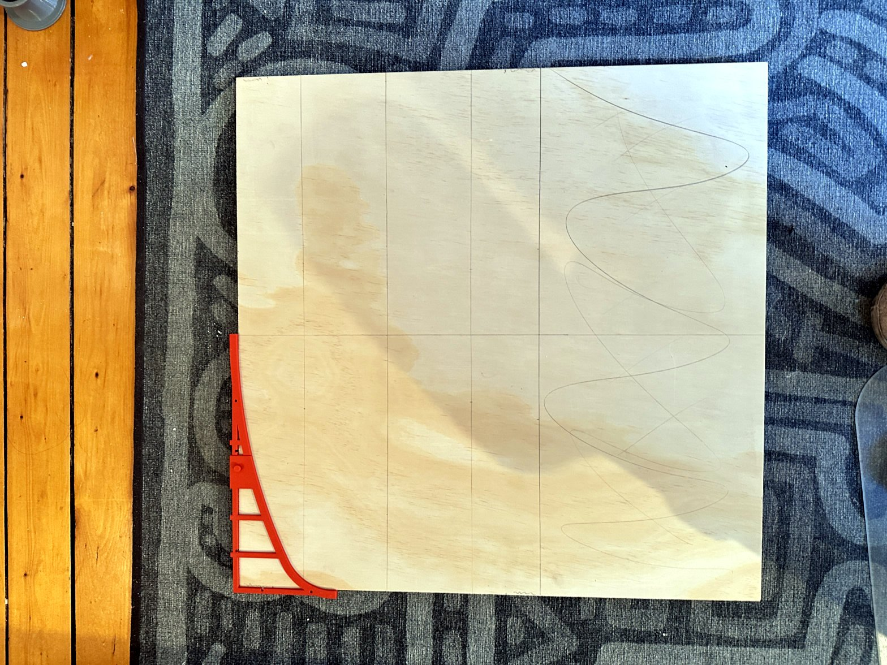

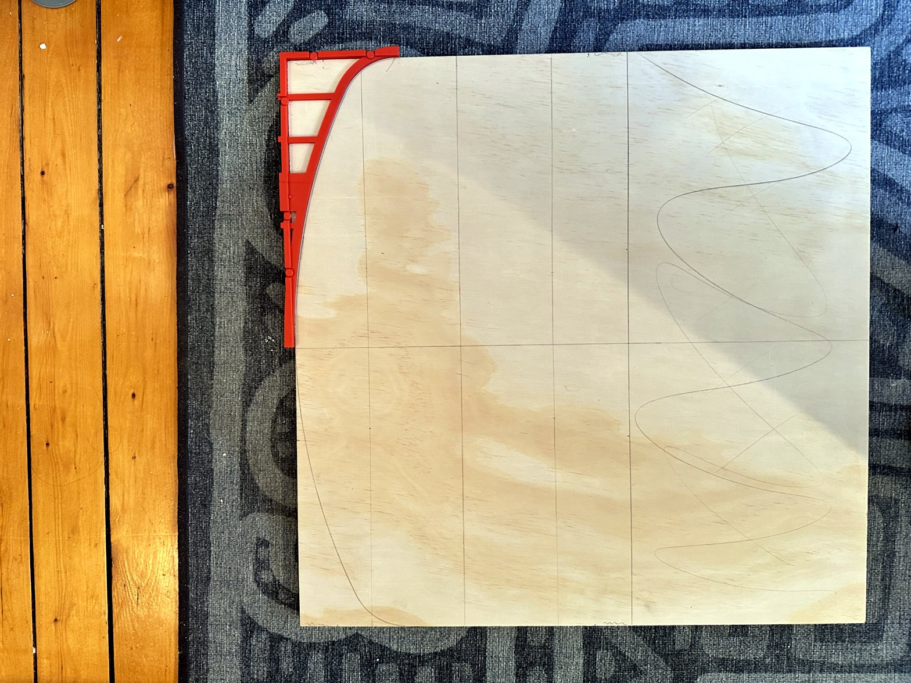

### Cutting and finishing

Jigsaw or bandsaw just outside the line, then sand back to it. A spindle sander
or a drum in a drill press makes short work of the R60 corners. Round the top
edges over with a 3–6 mm roundover or just break them with 120 grit — you'll be
standing on this barefoot.

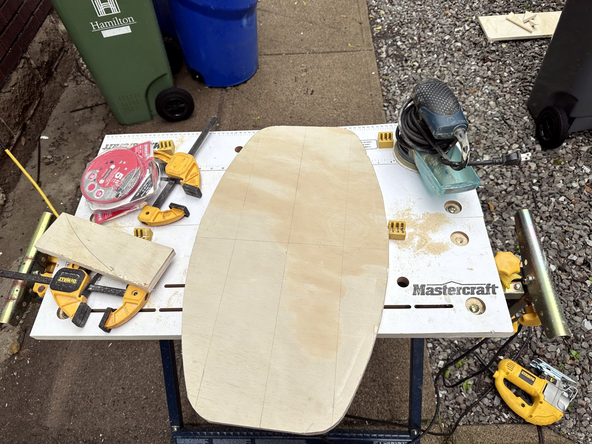

---

## Printing

### The stencil (this repo)

| File | Size | Notes |
| --- | --- | --- |
| `stl/brium_stencil_end.stl` | 169 × 129 × 7 mm | corner half — the R60 and most of the sweep |
| `stl/brium_stencil_mid.stl` | 175 × 34 × 7 mm | reaches the board's mid-length |
| `stl/brium_stencil_pegs.stl` | 8 pegs | print a couple spare |
| `brium_stencil.3mf` | — | ready-to-slice Bambu Studio project, all plates set up |

Flat on the bed, **no supports**. The plate prints first and the lip rail on
top of it, so nothing overhangs — flip each piece over to use it. Pegs print
head-down. Everything fits a 180 mm bed.

The two halves join with a half-lap and a 3 mm pin. Glue is optional; the pin
plus the lap is enough for a jig.

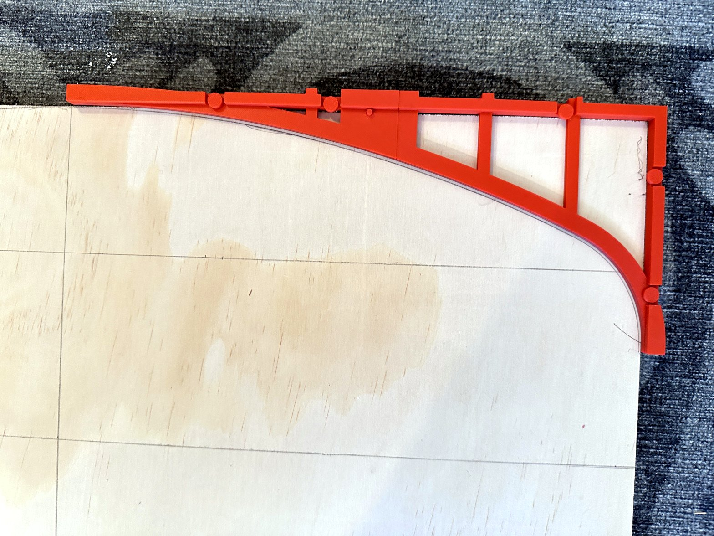

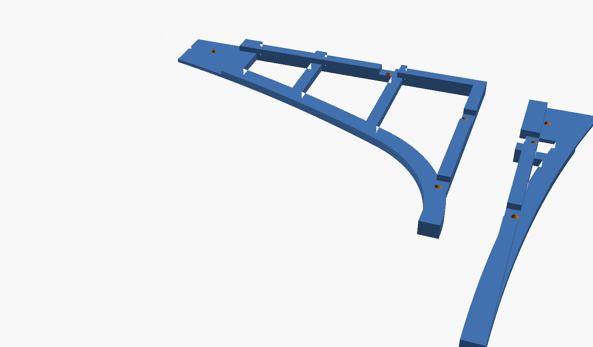

### The stand

**A remix of [dtxtr's stand](https://www.printables.com/model/1341613-balance-board-stand-board-and-ball)**,
modified to suit this build. His original is the design; this is a derivative
of it — go download and like his model too.

| File | Size | Notes |
| --- | --- | --- |
| `stl/brium_stand.stl` | 103 × 130 × 24 mm | one stand piece — print two |
| `brium_stand.3mf` | — | Bambu Studio project, sliced for a P1S |

125 cm³ of geometry, so budget roughly 150 g of filament per piece. The 3mf is
set up at 0.2 mm layers, 2 walls, 15 % infill, **no supports**, auto brim.

The stand is sized for 12 mm board stock — keep your plywood at 12 mm or adjust
the model to suit.

### The ball guard

Plywood, not printed — cut it from the 250 mm offcut. Dimensions are on
[dtxtr's page](https://www.printables.com/model/1341613-balance-board-stand-board-and-ball).

### The original Rola parts

Further up the family tree sits
**[whitespring's "Balance board pattern and parts"](https://www.printables.com/model/926271-balance-board-pattern-and-parts)**.
Their `Rola_Parts-v2.3mf` (two printed parts, ready-sliced in PrusaSlicer) is
included unmodified in [`third_party/whitespring/`](third_party/whitespring/) —
see that folder's README and their Printables page for usage and licence.

They mount to the board's underside with threaded inserts and M-screws:

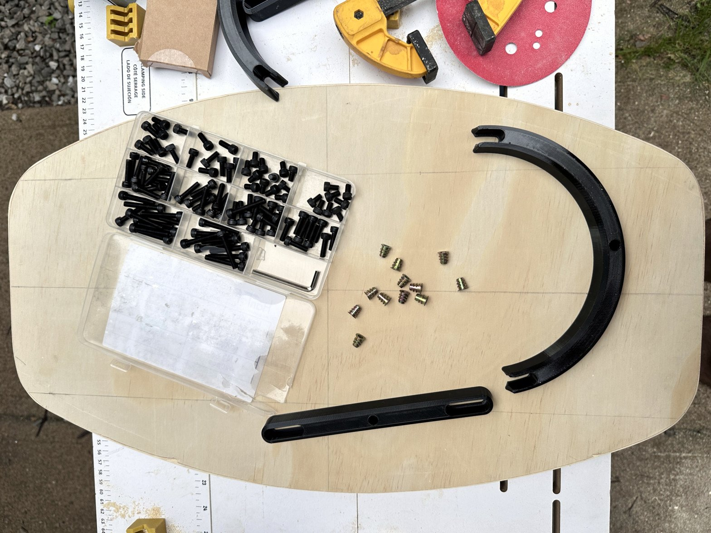

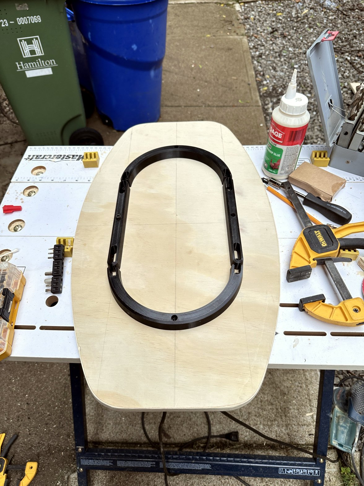

---

## Customising

Everything lives in `brium_stencil.scad`. Open it in
[OpenSCAD](https://openscad.org/), or use Window → Customizer for a form.

| Parameter | Default | Effect |
| --- | --- | --- |
| `BOARD_LEN` / `BOARD_WID` | 610 / 360 | your stock size — everything re-solves |
| `END_FLAT` | 128 | longer flat = squarer ends, flatter sweep |
| `CORNER_R` | 60 | tighter corners = more aggressive nose |
| `OVERHANG` / `LIP_T` | 6 / 3 | flange width past the edge, and lip depth |
| `PEGS` | true | peg holes for the flipped orientation |
| `TRACE_RIB` / `RIB_W` / `RIB_X` | 9 / 6 / 3 ribs | frame proportions |
| `PLATE_T` | 4 | plate thickness |
| `SPLIT_X` | 175 | where the two halves meet — lower it for a small bed |
| `PENCIL_COMP` | 0 | set to your pencil-tip radius (~0.7) so the drawn line lands on the true curve |
| `LIGHTEN` | true | rib frame vs solid crescent |

Re-export with:

```bash
./export_stl.sh
```

On macOS the OpenSCAD binary is inside the app bundle, which the script handles.
Set `PART` to `print_end`, `print_mid` or `pegs` if you'd rather export by hand
— **not** `assembly`, which is the two halves mated at 319 mm.

Deeper notes on the geometry, the joint and the mesh gotchas are in
[`docs/stencil.md`](docs/stencil.md).

---

## Repo layout

```
brium_stencil.scad     the parametric source — everything comes from here
export_stl.sh                  regenerates all three STLs
brium_stencil.3mf      Bambu Studio project, ready to slice
stl/                           exported meshes
third_party/whitespring/       whitespring's original Rola parts, unmodified
docs/stencil.md                design notes: geometry, joint, mesh validation
docs/images/                   renders and build photos
site/                          the landing site (Next.js, deploys on Vercel)
```

---

## Credits

- **[whitespring](https://www.printables.com/@whitespring)** — the
  [Balance board pattern and parts](https://www.printables.com/model/926271-balance-board-pattern-and-parts)
  ("Rola") that this whole family of boards traces back to. Their printed Rola
  parts are included unmodified in
  [`third_party/whitespring/`](third_party/whitespring/) — go like the
  original.
- **[dtxtr](https://www.printables.com/@dtxtr_339032)** — the original
  [Balance Board Stand (board and ball)](https://www.printables.com/model/1341613-balance-board-stand-board-and-ball).
  The board profile, the stand and the ball guard are all his design. This repo
  re-derives his outline for a different sheet size, wraps it in a layout jig,
  and includes a modified version of his stand. If you build this, go give his
  model a like first.
- Brium stencil design and OpenSCAD source:
  **[@klubieniecki](https://github.com/klubieniecki)**

## License

<!-- Pick one and delete the rest. CC BY-SA 4.0 is the usual choice for
     printable models and keeps you compatible with the remix culture on
     Printables/MakerWorld. -->

The OpenSCAD source and the exported **stencil** files in this repo are released
under **CC BY-SA 4.0**.

`brium_stand.stl` / `brium_stand.3mf` are a **derivative of dtxtr's stand**, not
original work. Before publishing this repo or a listing, check that his licence
permits derivatives and redistribution, and match whatever terms he set.

Everything under `third_party/` is **other people's work, included unmodified**
(currently whitespring's Rola parts) and is *not* covered by this repo's
licence — the terms on each original model page apply.
